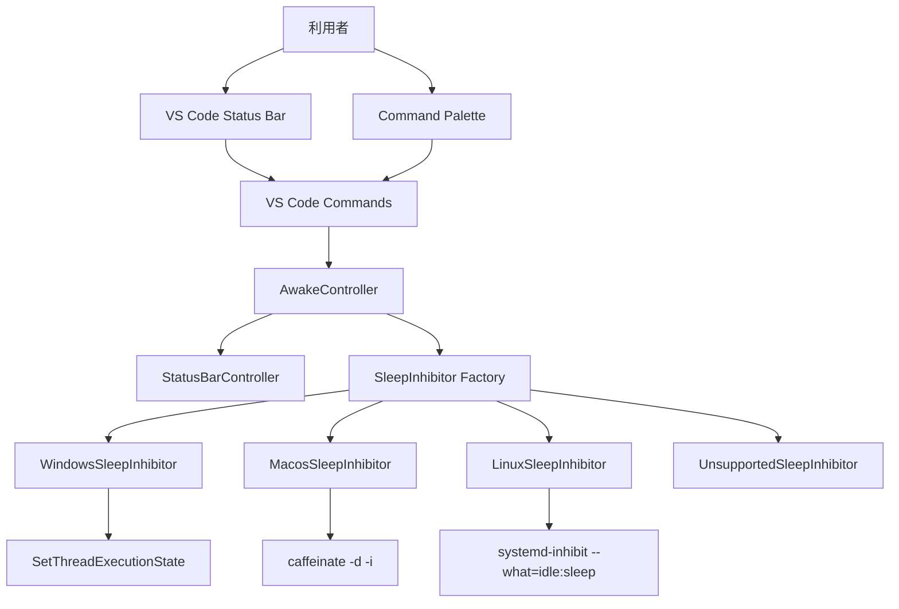

# 📘 AwakeScreen アーキテクチャ設計書

## 1. 🏷️ システム概要

- **アプリ名**: `AwakeScreen`
- **目的**: VS Code Desktop 上で、利用者が明示的に有効化している間だけ、画面 OFF と OS のアイドル判定による自動スリープを一時的に抑制する
- **対象ユーザー**: VS Code Desktop を利用する開発者
- **設計対象**: `E:\Projects\awake-screen` の VS Code 拡張機能本体
- **入力資料**:
  - `docs/01_requirements.md`
  - `src/extension.ts`
  - `src/test/extension.test.ts`
  - `package.json`
  - `README.md`
  - `AGENTS.md`
- **対象範囲**:
  - ステータスバー UI
  - コマンドパレット連携
  - OS 別スリープ抑制処理
  - エラー通知
  - 拡張終了時の解除処理
- **対象外**:
  - WebView
  - サイドバー
  - 専用設定画面
  - ネットワーク通信
  - 永続的な OS 設定変更
- **前提条件**:
  - 対象環境は VS Code Desktop
  - `package.json` の `extensionKind: ["ui"]` を実装時に追加する
  - Remote SSH / WSL / Dev Containers 利用時も UI 側で動作させる
- **現状実装**:
  - `src/extension.ts` は `awake-screen.toggle` / `enable` / `disable` を登録し、status bar と `AwakeController` を初期化する
  - status bar、共通状態遷移、共通エラー処理、OS 別 inhibitor、終了時解除処理を実装済み
  - `src/test/` には controller、status bar、OS 別 inhibitor、extension 結線の自動テストを持つ

## 2. 🧰 技術スタック

| 項目 | 採用技術 | 用途 | 現状 |
| --- | --- | --- | --- |
| 拡張ランタイム | VS Code Extension API | コマンド登録、ステータスバー、通知、ライフサイクル | 採用済み |
| 実装言語 | TypeScript | 拡張本体実装 | 採用済み |
| 実行環境 | Node.js on Extension Host | OS コマンド起動、プロセス制御 | 採用済み |
| バンドル | esbuild | `dist/extension.js` 生成 | 採用済み |
| 静的解析 | ESLint, TypeScript strict mode | lint / 型検査 | 採用済み |
| テスト | Mocha, `@vscode/test-cli`, `@vscode/test-electron` | VS Code ホスト上の回帰確認 | 実装済み |
| macOS 抑制 | `caffeinate -d -i` | 画面 OFF / アイドルスリープ抑制 | 実装済み |
| Linux 抑制 | `systemd-inhibit --what=idle:sleep` | 画面 OFF / アイドルスリープ抑制 | 実装済み |
| Windows 抑制 | PowerShell helper + `SetThreadExecutionState` | 画面 OFF / アイドルスリープ抑制 | 実装済み |

## 3. 🗂️ プロジェクト構造

設計上の責務分離は、要件 `6.5 保守性` の「UI 状態管理と OS 別抑制処理を分離する」を満たす構成を前提とする。

```txt
awake-screen/
├── docs/
│   ├── 01_requirements.md
│   └── 02_architect.md
├── src/
│   ├── extension.ts                  # activate / deactivate と依存組み立て
│   ├── application/
│   │   └── awakeController.ts        # ON/OFF 切替、状態遷移、重複実行防止
│   ├── domain/
│   │   ├── awakeState.ts             # OFF / STARTING / ON / ERROR
│   │   └── sleepInhibitor.ts         # 共通 IF
│   ├── infrastructure/
│   │   ├── inhibitors/
│   │   │   ├── macosSleepInhibitor.ts
│   │   │   ├── linuxSleepInhibitor.ts
│   │   │   ├── commandSleepInhibitor.ts
│   │   │   ├── createSleepInhibitor.ts
│   │   │   ├── windowsSleepInhibitor.ts
│   │   │   └── unsupportedSleepInhibitor.ts
│   │   └── process/
│   │       └── childProcessFacade.ts # spawn / kill の薄いラッパー
│   ├── ui/
│   │   └── statusBarController.ts    # 表示文言、Codicon、tooltip、command 設定
│   └── test/
│       ├── extension.test.ts
│       ├── awakeController.test.ts
│       ├── statusBarController.test.ts
│       ├── macosSleepInhibitor.test.ts
│       ├── linuxSleepInhibitor.test.ts
│       └── windowsSleepInhibitor.test.ts
├── package.json
└── README.md
```

## 4. 🧩 機能設計

### 4.1 🔌 拡張起動と初期化

| 観点 | 内容 |
| --- | --- |
| 入力 | VS Code による `activate` 呼び出し |
| 処理 | コントローラー、ステータスバー、OS 別 `SleepInhibitor` を生成し、コマンドを登録する |
| 出力 | 初期状態 `OFF` のステータスバー表示 |
| 制約 | 起動時に重い処理を行わず、抑制処理はまだ開始しない |

### 4.2 🎛️ ステータスバー状態管理

| 状態 | 表示 | クリック動作 | 備考 |
| --- | --- | --- | --- |
| `OFF` | `Awake` と OFF 用 Codicon | 有効化開始 | 起動時の既定状態 |
| `STARTING` | `Awake` とローディング Codicon | 無効 | 重複起動防止 |
| `ON` | `Awake` と ON 用 Codicon | 解除 | 抑制中 |
| `ERROR` | `Awake` と警告 Codicon | 再試行 | 通知表示対象 |

| 観点 | 内容 |
| --- | --- |
| 入力 | コントローラーからの状態変更通知 |
| 処理 | `text`, `tooltip`, `command` を状態ごとに更新する |
| 出力 | 利用者が状態を識別できるステータスバー表示 |
| バリデーション | 色に依存せず、アイコンとテキストで状態識別できること |

### 4.3 🔄 Toggle / Enable / Disable コマンド

| コマンド ID | 目的 | 処理 |
| --- | --- | --- |
| `awake-screen.toggle` | 現在状態に応じて ON/OFF 切替 | `OFF` / `ERROR` なら開始、`ON` なら解除、`STARTING` なら無視 |
| `awake-screen.enable` | 明示的な開始 | 開始処理を実行 |
| `awake-screen.disable` | 明示的な解除 | 解除処理を実行 |

| 観点 | 内容 |
| --- | --- |
| 入力 | コマンドパレット実行、またはステータスバークリック |
| 処理 | 状態遷移を一元化し、分岐を `awakeController` に集約する |
| 出力 | 状態更新、必要時の通知 |
| バリデーション | `STARTING` 中は追加実行を受け付けない |

### 4.4 🟢 スリープ抑制開始

| 観点 | 内容 |
| --- | --- |
| 入力 | `toggle` または `enable` |
| 処理 | `OFF/ERROR -> STARTING -> ON` の順で遷移し、OS 判定後に対応する `SleepInhibitor.start()` を呼ぶ |
| 出力 | 成功時は `ON`、失敗時は `ERROR` とエラー通知 |
| 例外 | 未対応 OS、コマンド不存在、API 呼び出し失敗、組織ポリシーによる拒否 |

### 4.5 🔴 スリープ抑制解除

| 観点 | 内容 |
| --- | --- |
| 入力 | `toggle`、`disable`、`deactivate` |
| 処理 | 稼働中 `SleepInhibitor.stop()` を呼び、必ず `OFF` へ戻す |
| 出力 | ステータスバー更新 |
| 例外 | 解除中エラーが起きても Extension Host に処理を伝播させず、ログ化して UI は `OFF` に戻す |

### 4.6 🖥️ OS 別実装責務

| 実装 | 入力 | 処理 | 出力 | 確認事項 |
| --- | --- | --- | --- | --- |
| `windowsSleepInhibitor` | 開始 / 解除要求 | Hidden PowerShell helper から `SetThreadExecutionState` を 30 秒ごとに呼び続け、停止時に helper を終了する | 成功 / 失敗 | 追加ネイティブ依存を避けつつ `extensionKind: ["ui"]` と両立させる |
| `macosSleepInhibitor` | 開始 / 解除要求 | `caffeinate -d -i` の起動と終了管理 | 成功 / 失敗 | `child_process.spawn` で常駐プロセスを管理 |
| `linuxSleepInhibitor` | 開始 / 解除要求 | `systemd-inhibit --what=idle:sleep` の起動と終了管理 | 成功 / 失敗 | `systemd-inhibit` 不在時は失敗 |
| `unsupportedSleepInhibitor` | 開始要求 | 未対応 OS として即失敗 | `ERROR` | Web / 未知 OS 用 |

### 4.7 🔔 エラー処理

| 観点 | 内容 |
| --- | --- |
| 入力 | 開始失敗、未対応 OS、コマンド不存在、API 呼び出し失敗 |
| 処理 | 共通エラー整形を行い、利用者向け通知文言へ変換する |
| 出力 | `showErrorMessage` と `ERROR` 表示 |
| 制約 | 制限回避を促すメッセージは出さない |

## 5. 🖥️ 画面設計

本拡張は要件どおり専用画面を持たず、利用者接点はステータスバーとコマンドパレットに限定する。

### 5.1 📍 ステータスバー

| 項目 | 内容 |
| --- | --- |
| 配置 | VS Code ステータスバー |
| 表示要素 | Codicon、固定テキスト `Awake`、tooltip |
| 主操作 | クリックで `awake-screen.toggle` 実行 |
| 表示責務 | 現在状態の可視化、再試行導線の提供 |

### 5.2 ⌨️ コマンドパレット

| 表示名 | コマンド ID | 用途 |
| --- | --- | --- |
| `Keep Awake: Toggle` | `awake-screen.toggle` | 通常操作 |
| `Keep Awake: Enable` | `awake-screen.enable` | 明示的開始 |
| `Keep Awake: Disable` | `awake-screen.disable` | 明示的停止 |

## 6. 🗺️ システム構成図



## 7. 🔌 外部インターフェース

| 種別 | 名称 | 方向 | 用途 | 備考 |
| --- | --- | --- | --- | --- |
| VS Code API | `registerCommand` | 呼び出し | コマンド登録 | `toggle` / `enable` / `disable` |
| VS Code API | `createStatusBarItem` | 呼び出し | 状態表示 | 常時 1 アイテム |
| VS Code API | `showErrorMessage` | 呼び出し | エラー通知 | 失敗時のみ |
| OS API | `SetThreadExecutionState` | 呼び出し | Windows 抑制 | Hidden PowerShell helper から定期呼び出しする |
| OS コマンド | `caffeinate -d -i` | 起動 / 終了 | macOS 抑制 | OS 標準コマンド |
| OS コマンド | `systemd-inhibit --what=idle:sleep` | 起動 / 終了 | Linux 抑制 | systemd 環境前提 |

## 8. 🧪 テスト戦略

| レイヤー | テスト対象 | 主な観点 |
| --- | --- | --- |
| 単体 | `awakeController` | 状態遷移、重複実行防止、失敗時 `ERROR` 遷移 |
| 単体 | `statusBarController` | 状態ごとの Codicon / text / command 更新 |
| 単体 | OS 別 `SleepInhibitor` | 開始 / 解除要求、未対応環境の失敗 |
| 統合 | `extension.ts` | コマンド登録、初期状態 `OFF`、`deactivate` 時の解除 |
| 回帰 | VS Code test host | ステータスバーとコマンドが要件どおりに動くこと |

`src/test/` は controller、status bar、各 inhibitor、extension 結線の回帰確認を満たす構成へ更新済み。

## 9. 🛡️ 非機能要件

| 区分 | 設計への反映 |
| --- | --- |
| デザイン | UI はステータスバーのみとし、Codicon とテキストで状態を表す |
| ユーザビリティ | 1 クリックで切替可能、起動時 `OFF`、通常操作では不要な通知を出さない |
| セキュリティ | 管理者権限不要、外部通信なし、任意コマンド入力なし、OS 制限回避なし |
| パフォーマンス | 起動時は表示初期化のみ、`OFF` では常駐処理なし、`STARTING` で重複起動防止 |
| 保守性 | UI、状態遷移、OS 別実装、プロセス制御を分離し、エラー処理を共通化する |

## 10. ⚠️ 矛盾・確認事項

### 10.1 ✅ 確定事項

- 現状コードは scaffold を置き換え、要件 `5.*` と `9` の主要機能を実装済み
- `package.json` には `awake-screen.toggle` / `enable` / `disable` を定義済みで、`extensionKind: ["ui"]` も設定済み
- 永続データ保存や DB は要件にも実装にも存在しないため、本設計では採用しない

### 10.2 ❓ 未確定事項

- なし

### 10.3 ⚠️ 要件内の矛盾

- `TRK-001` により `OFF` 表示は `$(vm-outline) Awake` へ統一した
- `TRK-001` により Marketplace 表示名と README 表記は `AwakeScreen` へ統一した
